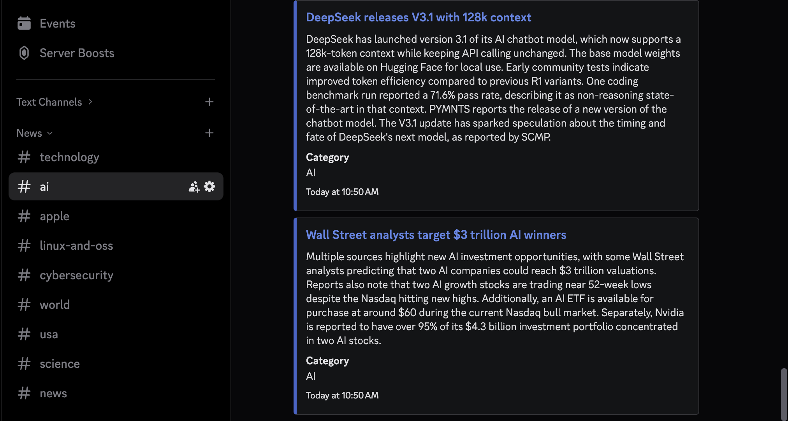

# Kagi Kite Discord Bot



A Discord bot that scrapes news from Kagi Kite, summarizes articles using the Kagi Summarizer API, and posts them to a Discord channel.

## Features

- Automatically fetches news from multiple Kagi Kite categories
- Summarizes articles using Kagi's AI summarization API
- Persistent storage to prevent duplicate posts
- Configurable polling intervals (24 hours by default)
- Category filtering via configuration
- Discord embeds

## Setup

1. Install dependencies:
   ```bash
   bun install
   ```

2. Create configuration file:
   ```bash
   cp config.example.json config.json
   ```

3. Edit `config.json` with your settings:
   ```json
   {
     "discord": {
       "token": "YOUR_DISCORD_BOT_TOKEN",
       "channelId": "YOUR_DEFAULT_CHANNEL_ID",
       "categoryChannels": {
         "Technology": "TECH_CHANNEL_ID",
         "AI": "AI_CHANNEL_ID",
         "World": "WORLD_NEWS_CHANNEL_ID"
       }
     },
     "kagi": {
       "apiKey": "YOUR_KAGI_API_KEY",
       "summarizeModel": "cecil",
       "enableSummarizer": true
     },
     "categories": [
       "Technology",
       "AI",
       "Cybersecurity"
     ],
     "polling": {
       "intervalHours": 24
     }
   }
   ```

4. Run the bot:
   ```bash
   bun run dev    # Development mode
   bun run build  # Build for production
   bun run start  # Run production build
   ```

## Docker Setup

### Prerequisites
- Docker and Docker Compose installed
- `config.json` configured (see setup instructions above)

### Quick Start

1. **Build and run with Docker Compose:**
   ```bash
   docker compose up -d
   ```

2. **View logs:**
   ```bash
   docker compose logs -f kagi-kite-bot
   ```

3. **Stop the bot:**
   ```bash
   docker compose down
   ```

## Configuration Options

### Discord
- `token`: Your Discord bot token
- `channelId`: Default Discord channel ID for news posts
- `categoryChannels` (optional): Map specific categories to different channel IDs

### Kagi
- `apiKey`: Your Kagi API key (only required if enableSummarizer is true)
- `summarizeModel`: Kagi summarization model (e.g., "cecil", "agnes", "daphne", "muriel")
- `enableSummarizer`: Set to `false` to skip summarization and use original Kite summaries

### Categories
Choose from available Kagi Kite categories:
- World, USA, Business, Technology, Science, Sports, Gaming
- Country-specific feeds (Australia, Canada, UK, etc.)
- Topic-specific feeds (AI, Apple, Bitcoin, Cybersecurity, etc.)

### Polling
- `intervalHours`: How often to check for new articles (default: 24)

## Available Categories

All Kagi Kite categories are supported:

**General News:**
World, USA, Business, Technology, Science, Sports, Gaming

**Countries/Regions:**
Australia, Austria, Belgium, Brazil, Canada, China, Colombia, Costa Rica, Czech Republic, Estonia, Finland, France, Germany, India, Ireland, Israel, Italy, Japan, Mexico, New Zealand, Pakistan, Palestine, Philippines, Poland, Portugal, Romania, Russia, Serbia, Slovenia, South Korea, Spain, Sweden, Switzerland (DE), Thailand, The Netherlands, UK, Ukraine

**Specialized Regions:**
Bay Area, Europe, China | Taiwan, Germany | Hesse, USA | Vermont, USA | Virginia

**Topics:**
AI, Apple, Bitcoin, Cryptocurrency, Cybersecurity, Economy, Linux & OSS, OnThisDay

## Storage

Articles are tracked in `sent-articles.json` to prevent duplicates. Records older than 30 days are automatically removed.

## License

MIT